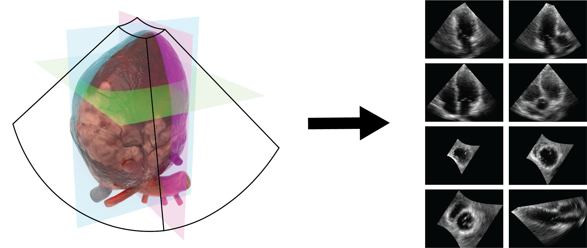

# EchoSlicer

This repository contains the official code for extracting standard echocardiography views from 3D+1 volumes.


## What is EchoSlicer?

EchoSlicer automatically extracts standard echocardiography views (A2C, A3C, A4C, A5C, PLAX, PSAX) from 3D echocardiography volumes using deep learning-based landmark detection and view classifier guided search. 


## Installation

### 1. Clone the repository
```bash
git clone https://github.com/echonet/3d-echo
cd 3d-echo
```

### 2. Download pre-trained models

**View Classifier:**
```bash
wget https://github.com/echonet/EchoPrime/releases/download/v1.0.0/model_data.zip
unzip model_data.zip
mv model_data/weights/view_classifier.pt view_classifier/
rm -r model_data
rm model_data.zip
```

**LV Segmentation Model:**
```bash
wget https://github.com/echonet/dynamic/releases/download/v1.0.0/deeplabv3_resnet50_random.pt
mv deeplabv3_resnet50_random.pt lv_segmenter/
```

### 3. Install dependencies

**Using [uv](https://docs.astral.sh/uv/getting-started/installation/):**
```bash
uv sync && source .venv/bin/activate
```

##  Demo
```bash
python demo.py
```
The extracted views will appear in the `sample_output` directory.
To visualize the output in the interactive streamlit app
```bash
   streamlit run app.py
```
[A demo should be running, as shown in this video](https://www.youtube.com/watch?v=ssF3slzh_Eo) 

## Output

The output contains:
- **8 mp4 files for each extracted view**: A2C, A3C, A4C, A5C, PLAX, PSAX (apex), PSAX (papillary muscles), PSAX (mitral valve), 
- **8 csv files** containing metadata for each view, including:
  - Plane orientation parameters (angles and position)
  - View dimensions in centimeters (height and width)
  - View classifier confidence score

## Dataset
We also release an open-source dataset of 29 three-dimensional echocardiogram videos. The data was collected by the authors themselves, who visited the echocardiography lab and recorded their own heart images. The dataset includes 15 volumes from Person A, 5 from Person B, 5 from Person C, and 4 from Person D. We hope this resource will encourage further research on AI in echocardiography.

The dataset can be downloaded from the github release
```bash
wget https://github.com/echonet/3d-echo/releases/download/v1.0/dataset.zip
```

## Citation

If you use this code or the dataset in your research, please cite the following paper:

**Automated Interpretable 2D Video Extraction from 3D Echocardiography** Milos Vukadinovic, Hirotaka Ieki, Yuki Sahashi, David Ouyang, and Bryan He.  
*arXiv preprint arXiv:2511.15946*, 2025.

```bibtex
@article{vukadinovic2025automated,
  title={Automated Interpretable 2D Video Extraction from 3D Echocardiography},
  author={Vukadinovic, Milos and Ieki, Hirotaka and Sahashi, Yuki and Ouyang, David and He, Bryan},
  journal={arXiv preprint arXiv:2511.15946},
  year={2025},
  url={[https://arxiv.org/abs/2511.15946](https://arxiv.org/abs/2511.15946)}
}

